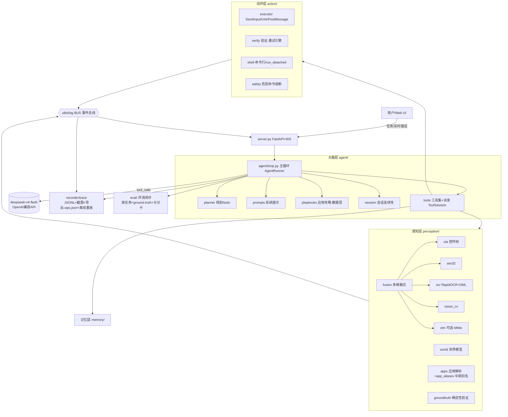
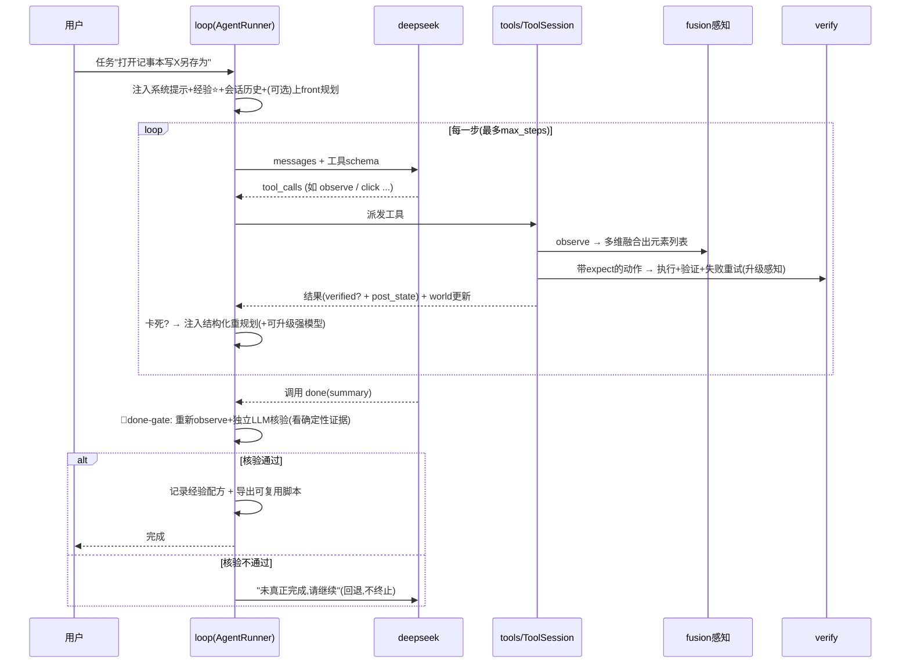
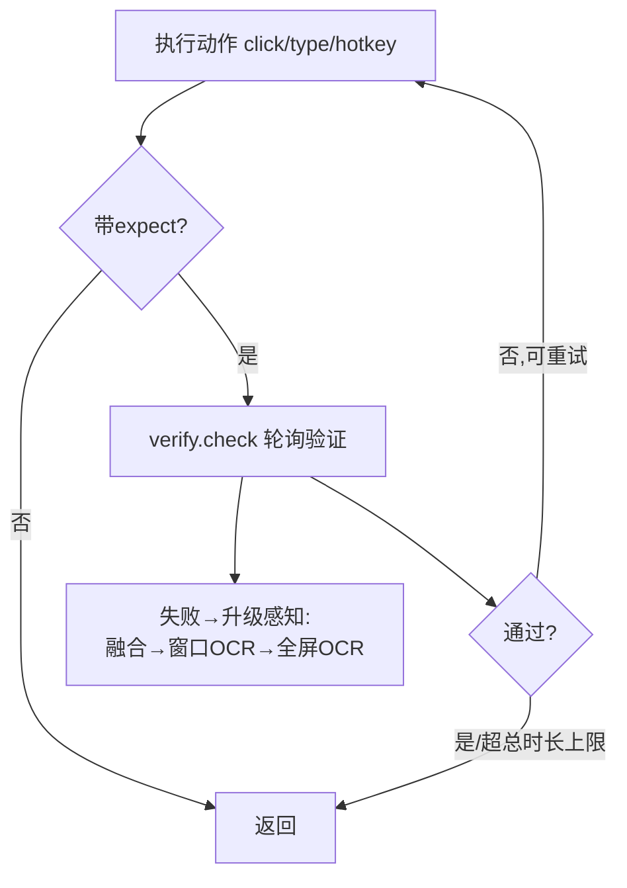
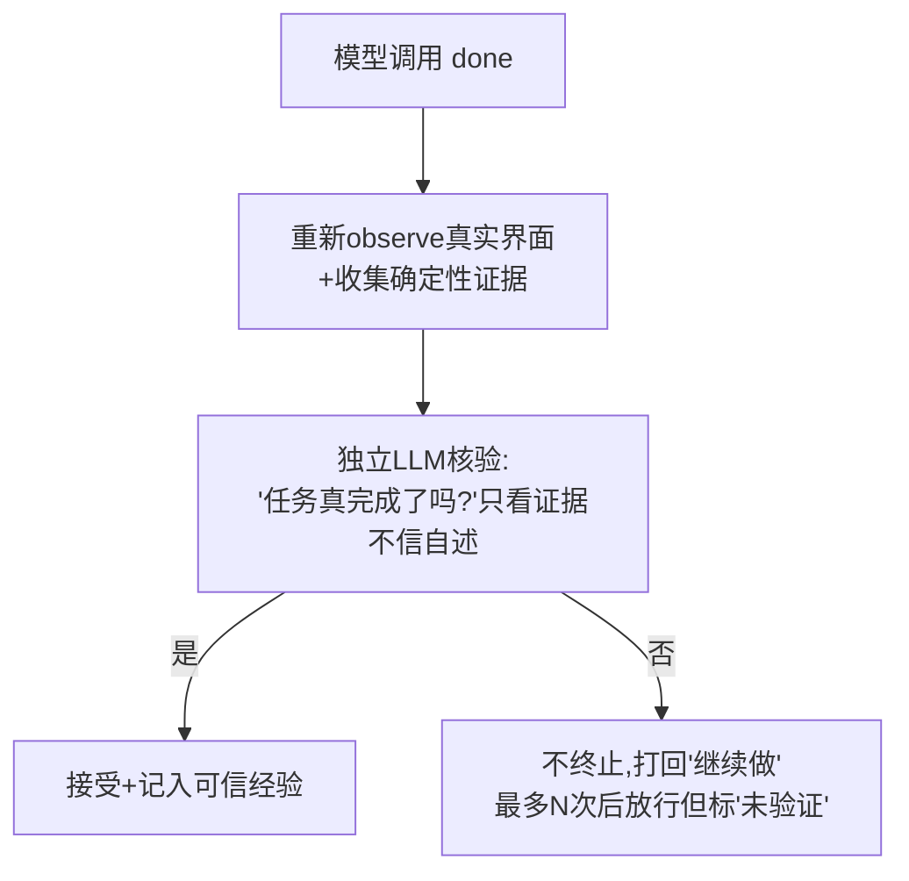
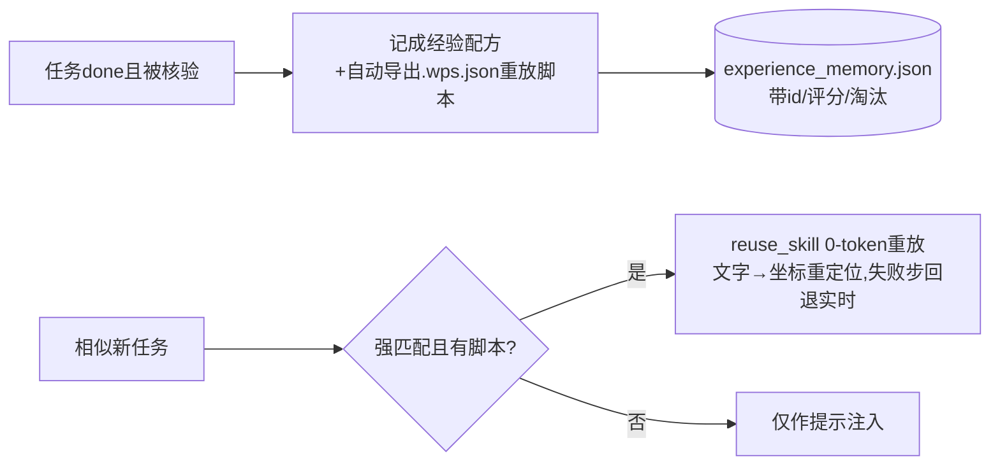
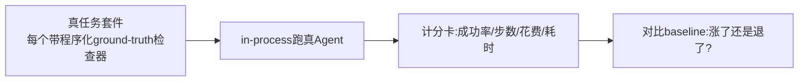

# WinPilot 架构与设计（面试讲解版）

> 一个为**纯文本大模型**打造的 Windows「computer-use」级操控 Agent。
> 规模:~6700 行 Python / 40 模块 / 15 套真机冒烟测试 + agent 级 eval 评测闭环。

本文目标:让你能在面试里**讲清楚它是什么、为什么这么设计、关键取舍是什么**。
每张图都配了大白话讲解,渲染不出图也能照着文字讲。

---

## 0. 一句话 & 核心洞察（电梯陈述）

> **"computer-use 通常靠多模态模型截图看屏幕;我做的是反过来——把屏幕用多维结构化感知(控件树/OCR/视觉)转成文字,让一个便宜的纯文本模型(deepseek-v4-flash)也能可靠操控 Windows GUI,并且带完整的验证、规划、记忆、评测闭环。"**

**核心洞察(面试最该讲的一点):**
GUI 自动化最难的不是"点哪",而是 **三件事**:
1. **看不见** —— 纯文本模型没有视觉 → 用 **多维感知融合** 把屏幕变成结构化文字。
2. **不知道做没做成** —— GUI 成功难判定("假完成") → 用 **确定性验证 + 独立核验门(done-gate)**。
3. **没法证明改动是进步** —— 改 prompt/逻辑全凭感觉 → 用 **agent 级 eval 闭环** 量化成功率。

这三点正好对应了我对标 Codex 时找到的最大差距,也是这个项目的主线。

---

## 1. 技术栈

| 层 | 用什么 | 为什么 |
|---|---|---|
| 大模型 | deepseek-v4-flash(纯文本,function-calling)+ 可选 MiMo-VL 视觉 | 便宜快;证明弱模型也能做 computer-use |
| 感知 | UIA(uiautomation)、Win32(pywin32)、OCR(RapidOCR + DirectML 本地 GPU)、OpenCV、可选 VLM | 替代"截图视觉",结构化、可解释、快 |
| 动作 | SendInput(物理输入)+ UIA Invoke/SetValue 快路径 + PostMessage 后台点击 | 准+快+可"不抢鼠标" |
| 服务/UI | FastAPI + WebSocket + 纯静态三件套(无构建) | 实时日志推送、零依赖前端 |
| 持久化 | JSONL trace、JSON 经验记忆、.wps.json 重放脚本 | 离线可重放、可复用、人类可读 |

---

## 2. 总体架构（分层）



**怎么讲这张图(从上往下一句话一层):**
- **用户/UI** 在浏览器输任务 → **server**(FastAPI)起一个后台线程跑 `AgentRunner`。
- **大脑层** = 一次 ReAct 循环:先(可选)规划 todo,把屏幕感知结果喂给 deepseek,模型回 `tool_calls`,派发执行。
- **感知层** = "眼睛":`fusion` 把 5 个维度(控件树/Win32/OCR/视觉/可选VLM)融合去重成一份**带坐标和来源标签的元素文本**。
- **动作层** = "手":`executor` 真点真打字,`verify` 验证有没有成功并重试,`shell` 跑命令,`safety` 拦灾难命令。
- **记忆/trace/eval** 是三条横切能力:经验复用、可离线重放、可量化评测。
- **BUS 事件总线** 把每一步广播给 UI(实时日志)和 trace(落盘)。

---

## 3. 一次任务的完整生命周期（端到端流程）



**大白话:** 模型不是"一步到位",而是**观察→思考→动作→验证**反复循环(ReAct 范式)。每个动作尽量带"期望结果"自动验证、失败自动重试并升级感知手段。模型说"做完了"也不直接信——先**独立核验**,真成了才记入经验+存成可复用脚本。

---

## 4. 六大核心机制（逐个讲,每个都是面试考点）

### 4.1 多维感知融合（解决"看不见")

```mermaid
flowchart LR
    H[目标窗口hwnd] --> O[observe]
    O --> U[UIA控件树]
    O --> W[Win32]
    O --> C[OCR文字]
    O --> V[CV图标]
    U & W & C & V --> MG[按优先级合并+IoU去重<br/>OCR文字嫁接到UIA无名元素]
    MG --> EMPTY{读到的元素为空?}
    EMPTY -->|是| ESC[升级:全屏OCR→VLM]
    EMPTY -->|否| OUT[输出: 每行<br/>'[id] 角色 文字 (x,y) 状态 src=来源']
    ESC --> OUT
```
- **为什么多维**:单一维度都有盲区——UIA 读不到自绘控件,OCR 读不到图标,CV 读不到文字。融合后互补。
- **关键技巧**:① IoU 去重 + **OCR 文字"嫁接"**到 UIA 的无名元素;② 每个元素标 `src=uia/ocr/cv` → **可解释、可调试**(知道是哪一维起作用);③ 维度可开关+优先级,任意排序都不崩(实测过)。
- **性能优化**:UIA 已经给够元素(≥20)就**跳过 6 秒的 OCR**;读到空快照才升级到更贵的全屏OCR/VLM。
- **面试可答的取舍**:为什么不直接上多模态截图?→ 慢(每步 +10s)、贵、坐标不准(我实测过 MiMo-VL grounding,要专门解码 0-1000 归一化坐标才到 5.7px);结构化感知快且可解释,VLM 留作兜底/可选主导模式。

### 4.2 动作→验证→重试 + 确定性 ground-truth（解决"不知道做没做成")


- **expect DSL**:`{text_appears/window_appears/screen_stable/color_match...}`,**外加确定性键** `{file_exists / file_contains / process_running / shell_true}`——这是 Codex 级的关键:**凡涉及文件/进程的,用确定性证据判定,不靠像素猜**。
- UIA Invoke 快路径:能用控件树直接 Invoke 就不用坐标点击,更稳。
- **单动作总时长硬上限**:防止像 `screen_stable` 在永不静止的画布上把一个动作卡死几分钟(我真踩过这坑)。

### 4.3 规划 + 世界模型 + 卡死恢复（长任务能力）

- **规划层(planner)**:多步任务先分解成 todo 子目标;子目标可挂 `check`,`complete_subgoal` 时**自动核验**才算完成,不许跳步。计划只注入一次(缓存友好)。
- **世界模型(world)**:跨步追踪"动作+界面指纹",检测**卡死**(连续重复动作 / 动作后界面无变化)。
- **结构化重规划**:卡死时(边沿触发,只报一次)注入"卡在哪/试过什么/换什么新法"的反思,并可**临时升级到更强模型(deepseek-v4-pro)**做这一个决策,随即回退便宜模型(成本可控)。

### 4.4 done-gate:杀"假完成"（最能体现 Agent 工程思维）


- **为什么**:弱模型常"自我感觉良好"地报完成。done-gate 是 Codex"claim done 前先跑测试"的 GUI 对应物。
- **关键**:judge 看**确定性证据**(`Test-Path→True`、run_shell 输出),不被"界面没显示"误导;**fail-open**(核验本身出错则放行,绝不死锁);有次数上限防无限循环。

### 4.5 技能记忆与复用(像复用脚本)


- **防"把错误当经验"**:只有被 done-gate 核验过的才存为可信;配方带**成功率打分**,屡试无效自动淘汰;步骤存**意图级**(`click "保存"`)不存死坐标。
- **像脚本复用**:成功流程自动变 `.wps.json`,下次同任务可 0-token 离线重放(实测记事本任务第二次 ¥0.0157)。

### 4.6 eval 评测闭环（让"别负优化"可验证）


- **绝不信 agent 自述**:检查器查真实文件/进程/回复(`eval/tasks.py`)。
- 这是整个项目的**方法论支柱**:每次改完跑一遍,数字说话。实测它抓到过两次真回归(done-gate 忽略证据导致空耗;某改动均步翻倍)。

---

## 5. 模块速查表（面试被问"这文件干嘛的")

| 模块 | 职责 |
|---|---|
| `agent/loop.py` | ReAct 主循环、上下文/缓存管理、done-gate、卡死恢复、模型升级 |
| `agent/tools.py` | ~25 个工具的 schema + 派发(ToolSession 持每轮状态) |
| `agent/prompts.py` | 系统提示(屏幕文本协议、命令行优先、验证规范) |
| `agent/planner.py` | 任务分解 todo + 子目标验证门 |
| `agent/session.py` | 会话连续性("再来一次"指代消解) |
| `agent/playbooks.py` | 逐应用攻略数据层(文件对话框/托盘等,从 prompt 抽出) |
| `perception/fusion.py` | 多维融合 + 空快照升级 |
| `perception/{uia,win32,ocr,vision_cv,vlm}.py` | 5 个感知维度 |
| `perception/world.py` | 世界模型(卡死检测) |
| `perception/apps.py`+`app_aliases.py` | 已安装应用解析(中文名→可执行)+中英窗口标题别名 |
| `perception/groundtruth.py` | 确定性验证(文件/进程/shell) |
| `action/executor.py` | SendInput/UIA/PostMessage(含"不夺光标"模式) |
| `action/verify.py` | 验证-重试引擎 + expect DSL |
| `action/shell.py` | 命令行执行 + run_detached(持久后台/定时) |
| `action/safety.py` | 危险命令熔断(灾难永久拦/危险按审批模式) |
| `memory/experience.py` | 经验配方:存/打分/淘汰/CRUD/复用解析 |
| `recorder/trace.py` | trace 落盘 + 导出 .wps.json + 离线重放引擎 |
| `eval/` | 评测套件 + 运行器 + baseline |
| `server.py` | FastAPI REST + WebSocket + 静态 UI |
| `utils/log.py` | BUS 事件总线(pub/sub) |

---

## 6. 关键设计决策与取舍（面试官最爱问"你为什么这么做")

1. **结构化感知 vs 多模态截图** → 选结构化(快/可解释/省钱),VLM 留可选兜底。代价:自绘/游戏画布是盲区(会显式提示并可切 VLM)。
2. **done-gate 用 LLM 判 vs 纯规则** → 混合:确定性证据优先 + LLM judge 兜底 GUI 类。代价:每次 done 多一次小调用(可关)。
3. **技能复用:重放 vs 提示** → 混合:强匹配可 0-token 重放,失败自动回退实时操作。代价:动态 UI 重定位会失败,所以必须有回退。
4. **缓存友好**:历史 append-only、计划/经验只注入稳定前缀、超 48K 才折叠 → DeepSeek prompt cache 命中 ~80%+。
5. **主动否决的负优化**:工具才 ~25 个,**没做**向量 Top-K 工具检索——会打爆前缀缓存,得不偿失(50+ 工具才值)。← 这条特别能体现判断力。
6. **安全**:灾难命令(格式化/关机/递归删系统目录/EncodedCommand)**永久熔断**,危险命令按 `approve_mode` 分级。

---

## 7. 模拟面试问答（背这几条)

**Q: 没有视觉怎么操控 GUI?**
A: 多维感知融合——UIA 控件树为主,Win32/OCR/CV 补盲,融合去重成带坐标和来源标签的文本喂给纯文本模型;读不到才升级到 VLM。

**Q: 怎么知道任务真的成功了(不是模型瞎说)?**
A: 三层——动作级 expect 验证(含 file_exists 等确定性键)、done-gate 独立 LLM 核验看证据、eval 用程序化 ground-truth 终判。

**Q: 怎么保证你的改动是优化不是负优化?**
A: agent 级 eval 闭环,固定真任务套件 + ground-truth 检查器 + baseline 对比成功率/步数/花费。我靠它抓到过真实回归。

**Q: 长任务怎么不跑飞?**
A: 规划层分解 todo + 子目标验证门 + 世界模型卡死检测 + 卡死时结构化重规划并可临时升级强模型。

**Q: 这套和 Codex 比差在哪?**
A: 差在(1)模型代差(我用便宜模型,靠脚手架补)(2)GUI 噪声 vs 文本确定性(先天)。但我把可补的都补了:验证、eval、规划、记忆复用,并诚实排除了不可行的(真双鼠标)和负优化的(向量工具检索)。

---

> 配套:`docs/面试速记.md`(一页速记)、`PROGRESS.md`(完整开发历程,可讲"迭代故事")、`tests/`(15 套真机测试)、`winpilot/eval/`(评测闭环)。
